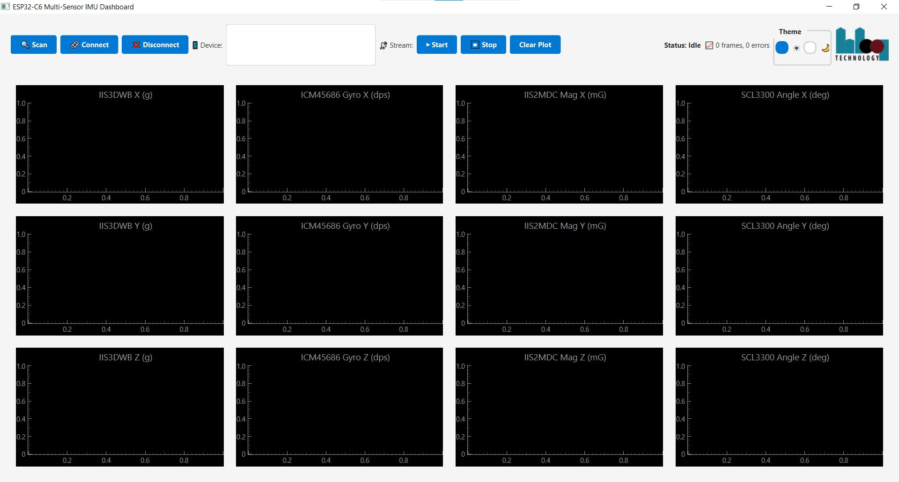

# ESP32-C6 Multi-Sensor IMU Dashboard 🧭

Open-source Python GUI for streaming and visualizing multi-sensor IMU data via BLE from ESP32-C6.



## Features
- 🔍 **Auto-scan** for ESP32-C6 IMU devices
- 🔗 **One-click connect** to BLE device
- 📡 **Real-time streaming** via BLE NOTIFY (Service: 0x1815, Char: 0x2A58)
- � **12-plot grid display**: 4 sensors × 3 axes (X/Y/Z)
- 🎨 **Light/Dark themes** for comfortable viewing
- 🧹 **Clear plots** on demand
- � **Live statistics**: frame count, error tracking

## Supported Sensors
| Sensor | Type | Unit | Mask Bit |
|--------|------|------|----------|
| **IIS3DWB** | Accelerometer | g | 0x0001 |
| **ICM45686** | Gyroscope | dps | 0x0004 |
| **IIS2MDC** | Magnetometer | mG | 0x0010 |
| **SCL3300** | Inclinometer | degrees | 0x0040 |

## Installation (Windows)

### 1. Install Python 3.11+
Download from [python.org](https://www.python.org/downloads/)

### 2. Create virtual environment
```powershell
python -m venv .venv
.\.venv\Scripts\Activate.ps1
```

### 3. Install dependencies
```powershell
pip install -r requirements.txt
```

## Quick Start

### Option 1: Run with script (Recommended)
**Windows PowerShell:**
```powershell
.\run.ps1
```

**Windows Batch:**
```cmd
run.bat
```

### Option 2: Manual run
```powershell
.\.venv\Scripts\Activate.ps1
python main.py
```

## Building Standalone Executable

### Create .exe file (no Python needed on target PC)
```powershell
.\build_exe.ps1
```

Output: `dist\ESP32-IMU-Dashboard.exe` (~50-100 MB)

See [BUILD_GUIDE.md](BUILD_GUIDE.md) for details.

## Usage Guide

### 1. Scan & Connect
1. Click **🔍 Scan** to discover BLE devices
2. Select your ESP32-C6 device (named "IMU-BLE") from the list
3. Click **🔗 Connect**

### 2. Start Streaming
1. Click **▶ Start** to begin data streaming
2. All 12 plots will update in real-time
3. Click **⏹ Stop** to pause streaming
4. Click **Clear Plot** to reset all graphs

### 3. View Data
- **Grid Layout**: 3 rows (X/Y/Z) × 4 columns (4 sensors)
- Each plot shows one axis of one sensor
- Colors: Red (X), Green (Y), Blue (Z)
- Only active sensors (present in frame) will update

## ESP32-C6 Protocol

### BLE Configuration
- **Device Name**: `IMU-BLE`
- **Service UUID**: `0x1815` (Automation IO)
- **Characteristic UUID**: `0x2A58` (NOTIFY)

### Frame Format (TLV)
```
Header (14 bytes):
- frame_len (2) + version (1) + sensor_mask (2) + sequence (4) + timestamp (4) + reserved (1)

Payload (Variable TLV blocks):
- Type (1 byte) + Length (1 byte) + Value (N bytes)
```

### Sensor Data Scaling
- **Accelerometer**: raw / 16384 → g
- **Gyroscope**: raw / 131.072 → dps
- **Magnetometer**: raw / 1.0 → mG
- **Temperature**: raw / 100 → °C
- **Angle**: raw / 100 → degrees

## Project Structure
```
ble-imu-dashboard/
├── core/                    # BLE & parsing logic
│   ├── ble_client.py        # BLE connection handler
│   ├── esp32_parser.py      # ESP32-C6 TLV frame parser
│   ├── packet_parser.py     # Generic parser (deprecated)
│   ├── data_buffer.py       # Data buffering
│   └── exporter.py          # Data export utilities
├── ui/                      # PyQt6 GUI
│   ├── main_window.py       # Main dashboard UI (12-plot grid)
│   ├── plot_widget.py       # Real-time plot widget
│   ├── style_dark.qss       # Dark theme stylesheet
│   └── style_light.qss      # Light theme stylesheet
├── main.py                  # Application entry point
├── requirements.txt         # Python dependencies
├── run.ps1                  # PowerShell launch script
├── run.bat                  # Batch launch script
└── README.md               # This file
```

## Troubleshooting

### Bluetooth not available
- Make sure Bluetooth is enabled on your PC
- On Windows 11, check Settings → Bluetooth & devices
- Verify Bluetooth adapter in Device Manager

### No devices found
- Ensure ESP32-C6 is powered on and advertising
- Move closer to the device (BLE range ~10m)
- Check if another app is connected to the device
- Try re-scanning after a few seconds

### Connection fails
- Restart the ESP32-C6 device
- Close other Bluetooth apps
- Restart Bluetooth service on PC

### Plots not updating
- Check if **▶ Start** button was clicked
- Verify sensor_mask in console debug output
- Ensure ESP32 is actually sending data (check sequence numbers)

### ImportError on startup
```powershell
# Reinstall dependencies
.\.venv\Scripts\Activate.ps1
pip install -r requirements.txt --upgrade
```

## Development

### Adding New Sensors
1. Update `sensor_mask` bit mapping in `esp32_parser.py`
2. Add TLV type code in `_parse_tlv_payload()`
3. Add scaling factor and field in `SensorData` dataclass
4. Create new `PlotWidget` in `main_window.py`
5. Update `on_ble_data()` to plot new sensor

### Testing Parser
```powershell
python test_esp32_parser.py
```

## License
MIT © 2025 Minh Hung

## Contributing
Pull requests welcome! Areas for improvement:
- [ ] Data export to CSV/JSON
- [ ] FFT/spectral analysis
- [ ] Recording and playback
- [ ] Multi-device support
- [ ] Calibration tools

## References
- [ESP32-C6 Documentation](https://docs.espressif.com/projects/esp-idf/en/latest/esp32c6/)
- [Bleak BLE Library](https://github.com/hbldh/bleak)
- [PyQt6 Documentation](https://www.riverbankcomputing.com/static/Docs/PyQt6/)
